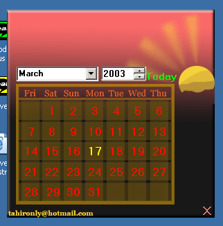



## Calander\(A day finder\)

### Description

A greate discovery in computational Math to find the day name of a known date of millions years ago.This is my own eefort of months to find it out.now you can find the day of week from year 0 A.D to the Max limit of your data type .I am working to discover method to find out day of week of B.C dates and i have got near to success and soon i will uncovered that.Sample project is not enough work this is just for demonstration of one use of actual algo.My effort is "Private Function Dnum(dae As Integer, mon As Integer, Yea As Long) As Integer

" check it out and grab my logic out.dont forget to vote this effort.
 
### More Info
 
the sample application included as uncompiled form.Main algorthim is {[(Dnum)]} named function which accepts three Numbers which are stands for Day,Month and Year factors of a date.

Visual Basic,Maths

Dnum function return a number

within rage of 0 to 6

these numbers are relative of days of week

0 Friday

1 saturday

2 sunday

............ so on

             |
---                |---
**Submitted On**   |2003-03-16 14:35:56
**By**             |[S\.Tahir A\. Naqvi](https://github.com/Planet-Source-Code/PSCIndex/blob/master/ByAuthor/s-tahir-a-naqvi.md)
**Level**          |Intermediate
**User Rating**    |4.8 (29 globes from 6 users)
**Compatibility**  |VB 6\.0
**Category**       |[Math/ Dates](https://github.com/Planet-Source-Code/PSCIndex/blob/master/ByCategory/math-dates__1-37.md)
**World**          |[Visual Basic](https://github.com/Planet-Source-Code/PSCIndex/blob/master/ByWorld/visual-basic.md)
**Archive File**   |[Calander\(A1560713162003\.zip](https://github.com/Planet-Source-Code/s-tahir-a-naqvi-calander-a-day-finder__1-44054/archive/master.zip)

